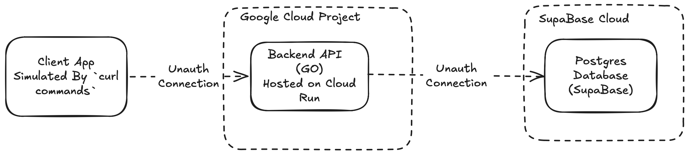

# Appointment Booking System In Go

## Project Objective

<!--  -->

The task was to design a booking system that would allow users to book, cancel, reschedule and appointments

## Running Locally

### Postgres

```bash
./run-postgres.sh # Deploys the database
```

### Go Program

```bash
cd api
cd .env.example .env
go run main.go

```

## Live URL

[https://appointment-booking-1020741950373.africa-south1.run.app/api/v1](https://appointment-booking-1020741950373.africa-south1.run.app/api/v1)

## Assumptions

Data in this system has been pre-seeded. By running the app locally using the `ENVIRONMENT=development` the app shoudl pre-seed the values into the database.

- The `Rest Client` should provide an endpoint to add new patients before they can present create an appointment using their respective client Ids

## Important Note

The Examples that follow use `UUIDs` that may drift and hence fail to work. hence after seeding make sure your query the `/patient` and `/doctor` endpoints to get the respective values to substitute in the example.

### Create Appointments

```bash
curl --location 'https://appointment-booking-1020741950373.africa-south1.run.app/api/v1/appointments' \
--header 'Content-Type: application/json' \
--data '{
"patient_id": "{patient_id}",
"doctor_id": "{doctor_id}",
"start_time": "{start_time}",
"end_time": "{end_time}",
"status": "scheduled"
}'
```

### Get Slots

```bash
curl --location 'https://appointment-booking-1020741950373.africa-south1.run.app/api/v1/doctors/{:doctor_id}/availability?date={date}'
# The date format should be 2026-09-25
```

### Cancel Appointment

```bash
curl --location --request PATCH 'https://appointment-booking-1020741950373.africa-south1.run.app/api/v1/appointments/{appointment-id}/cancel?reason={reason}'
```

### Reschedule Appointment

```bash
curl --location --request PATCH 'https://appointment-booking-1020741950373.africa-south1.run.app/api/v1/appointments/{appointment-id}/reschedule?new_start_time={start-time}&new_end_time={end-time}'

# Start time = 2026-09-25T10:00:00%2B03:00  The %2B is to help the encoding
# End time = 2026-09-25T10:30:00%2B03:00  The %2B is to help the encoding
```

### Get Patients Appointments

```bash
curl --location 'https://appointment-booking-1020741950373.africa-south1.run.app/api/v1/patients/{patient-id}/appointments'
```

### Get Patients

```bash
curl --location 'https://appointment-booking-1020741950373.africa-south1.run.app/api/v1/patients'
```

### Get Doctors

```bash
curl --location 'https://appointment-booking-1020741950373.africa-south1.run.app/api/v1/doctors'
```

## Required Methods

| Methods | url                            | query params                                       | body                                                          |
| ------- | ------------------------------ | -------------------------------------------------- | ------------------------------------------------------------- |
| `POST`  | `/appointments`                |                                                    | `patient_id`, `doctor_id`, `start_time`, `end_time`, `status` |
| `GET`   | `/doctors/:id/availability`    | `doctor_id`                                        |                                                               |
| `PATCH` | `/appointments/:id/cancel`     | `appointment_id`, `reason`, `patient_id`           |                                                               |
| `PATCH` | `/appointments/:id/reschedule` | `appointment_id`, `new_start_time`, `new_end_time` |                                                               |
| `GET`   | `/patients/:id/appointments`   | -                                                  |                                                               |
| `GET`   | `/health`                      | -                                                  | -                                                             |

## Supporting Methids

| Methods | url         |
| ------- | ----------- |
| `GET`   | `/patients` |
| `GET`   | `/doctors`  |

## Architetural Decisions

Based on the requirements, `Postgres` was selected as the primary database as it guarantees strong consistency and ACID compliance which solves the double booking problem. A consideration was made for Firebase due to its free tier being good for prototyping.
The architecture needs to be easily scalable and cost effective for a startup solution: We should then use `Cloud Run` since it has the ability to scale to infiitely to handle increased load, scale to zero to save cost as well as a generous free tier suitable for a starting system.

### Stakeholders

Doctors -> They have a schedule that the patients abide by.
Patients -> They can book, view , cacle and reschedule their appointments.

### Data Models

| Data Model                | Fields                                                    | Addtional Info                                                                                                                                                               |
| ------------------------- | --------------------------------------------------------- | ---------------------------------------------------------------------------------------------------------------------------------------------------------------------------- |
| Doctor                    | `id`, `name`                                              | -                                                                                                                                                                            |
| Schedule                  | `doctor_id`, `day_of_week`, `start_time`, `end_time`      | -                                                                                                                                                                            |
| Appointments              | `doctor_id`, `patient_id`, `start_at`, `end_at`, `status` | `start_at` and `ends_at` should be validated to maintain the 30 minutes                                                                                                      |
| Patient                   | `id`, `email`, `name`                                     | Patients will be preseeded but in the production environment, there would be a front end client signing up the user or providing a validation step to identify the user e.g. |
| Appointments Cancellation | `id`,`patient_id`, `reaason`                              | -                                                                                                                                                                            |

### Design of Booking Solution Type

When designing the schema there we had determine the schema between, fixed slot-based system and a time blocking system. The fixed block time system involved seeding the database with the time slots and the requests later fill in the values i.e., Adding the vaues e.g., This makes writing the load heavy and reading the lighter operation but may lead to wasted space as appointment slots may not be utilized.

| id     | patient_id | doctor_id        | start_at | end_at   | status |
| ------ | ---------- | ---------------- | -------- | -------- | ------ |
| `<id>` | `null`     | `some_doctor_id` | 10:00:00 | 10:30:00 | open   |

### Utilized Solution

The alternative was using time blocking system where you add the appointments directly to the data base upon request. This makes the reading operation slightly more operationally heavy, especially when fetching free availability slots.

## Architecture



## Deployment

The solution is deployed on `Cloud Run` and the [live url is available here](https://appointment-booking-1020741950373.africa-south1.run.app)

The CI/CD is handled on Google Cloud Build using triggers.

- On `push` to `main` the tests are run the tests are defined as inline YAML in Google Cloud.

- The reason I moved to primarily handling CI/CD on Google Cloud was due to the authentication and ease of management. Since the environment is authenticated there is no additional management overhead required for managing Service Accounts and securing their respective Keys.

## AI Reflection

The AI reflection files is [available here](./Ai_review.md)
